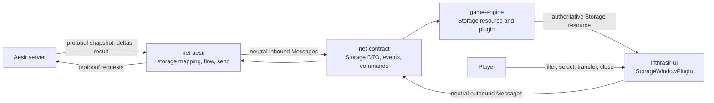
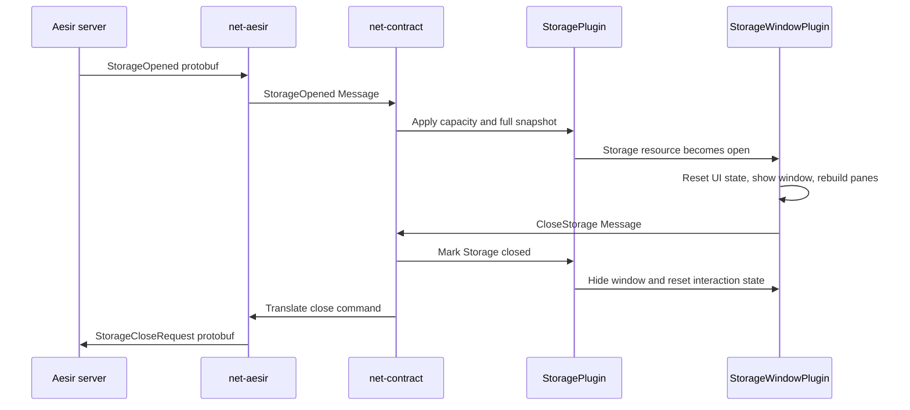
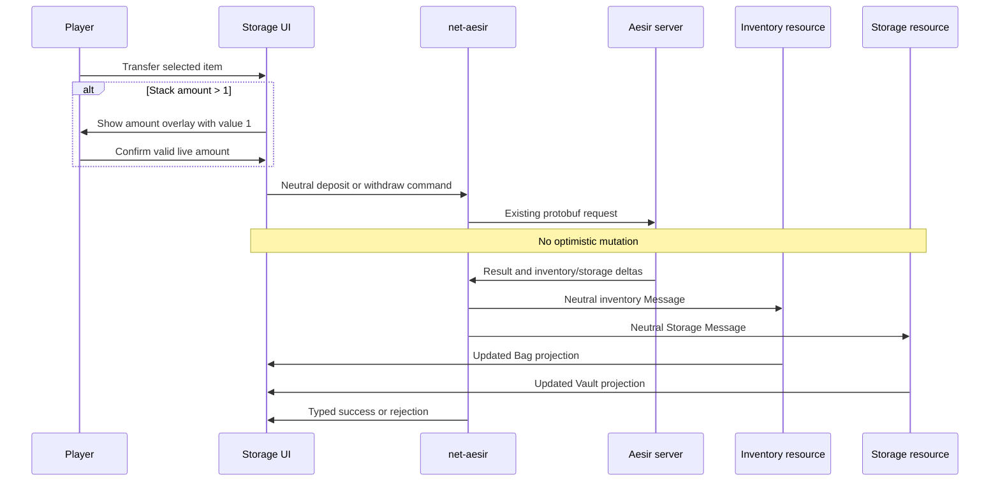
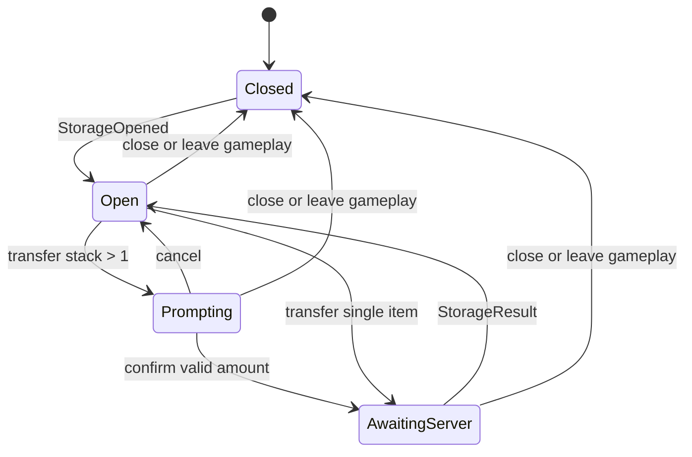

# Storage System Architecture

## Summary

This document defines the technical design for the [Storage System specification](./spec.md). Storage is implemented as a dedicated vertical slice: protocol-neutral Messages in `net-contract`, protobuf translation in `net-aesir`, authoritative container state in `game-engine`, and a Bevy Feathers window with presentation-only state in `lifthrasir-ui`.

The design mirrors the existing Pushcart path where that pattern fits, while keeping the Storage search field and amount input stable across dynamic pane rebuilds. The verified runtime is Bevy `0.19.0` with `bevy_feathers` `0.19.0`.

## Considered Approaches

### Dedicated Storage vertical slice

Add Storage-specific contract types, adapter mappings, engine state, and UI modules. This follows the existing Cart/Pushcart boundary, keeps each responsibility testable, and avoids changing unrelated systems. This approach was selected.

### UI-owned Storage state

Let `lifthrasir-ui` consume network events and own the server snapshot directly. This needs fewer engine files, but it mixes authoritative game state with presentation state, duplicates delta handling in the UI, and prevents future gameplay systems from reading Storage without depending on the UI crate. It was rejected.

### Generic container framework

Refactor Inventory, Cart, and Storage around generic container resources and generic transfer UI. This could remove some repeated mechanics, but it expands a bounded feature into a risky cross-feature refactor and introduces abstractions before a third shared implementation proves their value. It was rejected.

## System Overview

`net-contract` remains the only network dependency visible to `game-engine` and `lifthrasir-ui`. `net-aesir` is the sole owner of generated protobuf types and QUIC sending. The executable wiring remains unchanged because `CoreGamePlugins`, `LifthrasirUiPlugin`, and `AesirNetPlugin` already sit at their respective composition boundaries.

## Components

### Protocol-neutral contract

New file `net-contract/src/dto/storage.rs` defines `StorageItem`. It carries the intersection of fields present in both a full `StorageOpened` item and a `StorageItemAdded` delta:

- `index`, `nameid`, `amount`, `type_`, `location`, `attribute`, `refine`, `expire_time`, `look`, and `weight` as `u32`;
- `identified` as `bool`;
- `cards` as `Vec<u32>`.

Storage indices and amounts remain `u32` end-to-end, matching the existing protobuf and avoiding lossy narrowing. `net-contract/src/dto/mod.rs` exports the new DTO.

New file `net-contract/src/events/storage.rs` defines:

- `StorageOpened { capacity: u32, items: Vec<StorageItem> }`;
- `StorageItemAdded { item: StorageItem }`;
- `StorageItemRemoved { index: u32, amount: u32, reason: u32 }`;
- `StorageResult { outcome: Result<(), StorageRejection> }`.

`StorageRejection` contains `Full`, `InventoryFull`, `Overweight`, `NotStorable`, `ItemEquipped`, `InvalidAmount`, `NotOpen`, `BasicSkillRequired`, and `Unknown(i32)`. `net-contract/src/events/mod.rs` exports the module.

`net-contract/src/commands.rs` adds:

- `DepositStorageItem { inventory_index: u32, amount: u32 }`;
- `WithdrawStorageItem { storage_index: u32, amount: u32 }`;
- `CloseStorage`.

Each event and command derives `Message` and uses `auto_add_message(plugin = crate::NetContractPlugin)`, matching Cart. `NetContractPlugin` therefore remains generated by the existing macro; only its registration test is extended.

### Aesir adapter

New file `net-aesir/src/zone/mapping/storage.rs` owns pure conversions:

- `StorageOpened` protobuf to the neutral snapshot;
- `StorageItemAdded` and `StorageItemRemoved` protobufs to neutral deltas;
- `StorageResultCode` to `Result<(), StorageRejection>`.

All known codes map explicitly. Unknown integer codes are preserved as `StorageRejection::Unknown(code)` and logged; they are never treated as success. The generated file `net-aesir/src/proto/aesir.net.rs` is not edited.

New file `net-aesir/src/zone/flow/storage.rs` adds `zone_drain_storage`. It reads the shared `IncomingMessage` stream and writes neutral `StorageOpened`, `StorageItemAdded`, `StorageItemRemoved`, and `StorageResult` Messages for matching `Body` variants. It uses the existing `auto_add_system` registration on `AesirNetPlugin`.

New file `net-aesir/src/send/storage.rs` builds and sends `StorageDepositRequest`, `StorageWithdrawRequest`, and `StorageCloseRequest` bodies on `GAMEPLAY`. The send systems follow the current Cart guard: when the client is not connected or `ZonePhase` is not `Playing`, commands are cleared; send failures are logged.

The new modules are exported from `net-aesir/src/zone/mapping/mod.rs`, `net-aesir/src/zone/flow/mod.rs`, and `net-aesir/src/send/mod.rs`.

### Authoritative Storage domain

New module `game-engine/src/domain/storage/` contains:

- `resource.rs`: `Storage` and its focused state operations;
- `systems.rs`: contract Message application and lifecycle reset;
- `plugin.rs`: `StoragePlugin` scheduling;
- `mod.rs`: public exports.

`Storage` is a Bevy `Resource` with:

- `items: BTreeMap<u32, StorageItem>`;
- `capacity: u32`;
- `open: bool`.

Its interface provides `open(capacity, items)`, `upsert(item)`, `remove_amount(index, amount)`, `close()`, `reset()`, `is_open()`, `capacity()`, `get(index)`, `iter()`, `len()`, and `is_empty()`. `open` replaces the prior map and capacity atomically. `remove_amount` decrements a stack and removes it at zero.

`systems.rs` defines:

- `apply_storage_opened` to replace the snapshot and mark Storage open;
- `apply_storage_item_deltas` to apply adds/removals only while open;
- `apply_storage_close` to observe `CloseStorage` and mark the resource closed immediately;
- `reset_storage` to clear all state on `OnExit(GameState::InGame)`.

`StoragePlugin` orders the snapshot system before delta application and close after both. `game-engine/src/domain/mod.rs` exports the module; `game-engine/src/lib.rs` re-exports and installs `StoragePlugin` in `CoreGamePlugins` next to `InventoryPlugin` and `CartPlugin`.

To share item categorization without duplicating RO item-type matching, `game-engine/src/domain/inventory/item.rs` exposes a small `item_category(item_type: u32) -> ItemCategory` function. Existing `Item::category` delegates to it, and Storage pane projection uses it.

### Bevy Feathers Storage window

New module `lifthrasir-ui/src/widgets/storage_window/` contains:

- `mod.rs`: plugin, component/resource types, observers, systems, and pure interaction helpers;
- `scene.rs`: Bevy Scene Notation, Feathers controls, view models, and pure projection helpers.

`StorageWindowPlugin` installs the Norse Feathers theme if needed, initializes `StorageUi`, and registers systems only while `GameState::InGame`. `lifthrasir-ui/src/widgets/mod.rs` exports and registers the plugin in `InGameHudPlugin`; `show_hud` spawns one hidden Storage shell beneath the HUD root.

`StorageUi` owns presentation-only state:

- active `StorageCategory` (`All`, `Use`, `Etc`, or `Equip`);
- normalized search query;
- optional `StorageSelection` (`Bag(u16)` or `Vault(u32)`);
- optional `PendingTransfer`;
- `awaiting_result: bool`;
- optional panel error;
- last clicked selection and timestamp;
- previous open state for lifecycle transitions.

The UI shell is stable for the lifetime of the in-game HUD. It includes the draggable title bar, `Storage Vault` label, category buttons, `EditableText` search field, two marked pane hosts, directional transfer buttons, red error region, close footer, and amount-overlay host. Pane and overlay children are rebuilt when `Inventory`, `Storage`, or `StorageUi` changes; the search entity itself is never destroyed while typing, preserving `InputFocus` and cursor state.

`scene.rs` uses `FeathersButton`, `FeathersScrollbar`, `ScrollArea`, `EditableText`, `EntityScene`, existing chrome helpers, theme tokens, `item_icon_path`, and `ItemDb`. The amount field also uses Bevy 0.19's `EditableTextFilter` to accept ASCII digits only. Existing `Placeholder` and focus-mirroring systems handle hint visibility and gameplay-input gating. No new dependency is added.

Bag projection filters out `Item::is_equipped()` before category and case-insensitive name filtering. Vault projection uses `item_category`, `ItemDb`, and the same query/category predicate. Both projections produce deterministic index order from their underlying `BTreeMap`s.

All directional buttons, cell quick-transfer buttons, and double-clicks call one `begin_transfer` helper. Quick-transfer children stop pointer propagation with `On<Pointer<Click>>::propagate(false)`. Double-click uses the existing Bag-tab timestamp pattern. A source amount of one emits immediately; a larger amount creates `PendingTransfer` and an overlay initialized to `1`.

Confirming the overlay re-reads the live source item, validates `1..=available`, and emits either `DepositStorageItem` or `WithdrawStorageItem`. It then sets `awaiting_result`; all transfer controls remain disabled until a `StorageResult` arrives. Neither the observer nor any UI system mutates `Inventory` or `Storage`.

## Data & Flows

### Open and close

The engine and adapter maintain independent `MessageReader<CloseStorage>` cursors, so the same command can close local state immediately and still reach the server. A later `StorageOpened` fully replaces stale contents and makes the window visible again.

### Deposit and withdrawal

The pane rebuild system is explicitly ordered after both Inventory and Storage Message-application systems. A rendered frame therefore reflects all container deltas processed in that update instead of an avoidable half-applied transfer.

### UI lifecycle

Only one request can be in flight because `StorageResult` has no request identifier. QUIC supplies reliable ordered transport, so no retry or timeout subsystem is added.

## Technology Choices

- Bevy `0.19.0` is the verified ECS, state, scene, input, and UI runtime.
- `bevy_feathers` `0.19.0` supplies controls, scrollbars, and theming.
- BSN and `EntityScene` match the current Pushcart, Shop, and NPC-dialog composition style.
- Bevy `Message`s preserve the existing protocol-neutral boundary.
- `BTreeMap` provides deterministic index order and direct slot lookup.
- `EditableText`, `EditableTextFilter`, and `InputFocus` cover search and numeric input without another crate.
- The existing item database, item-icon path, chrome helpers, draggable behavior, and theme tokens are reused.
- No generic container framework, async task, optimistic cache, retry layer, drag-and-drop dependency, or protobuf change is introduced.

## Error Handling & Edge Cases

- A new transfer clears the previous panel error.
- Empty, zero, out-of-range, or otherwise invalid amount input stays in the overlay and renders red validation text; it emits no command.
- Confirmation always validates against the live source stack, not the amount captured when the overlay opened.
- A disappearing selection or filtered-out item clears selection and disables transfer controls.
- While `awaiting_result` is true, all transfer affordances are disabled to prevent ambiguous concurrent results.
- Known `StorageRejection` values map to specific red panel messages.
- `Unknown(code)` logs a warning and displays a generic red message containing the code.
- A successful result clears `awaiting_result` and leaves the error empty; a rejection clears `awaiting_result` and sets the panel error.
- Snapshot events replace all items and capacity. Added deltas upsert the server-reported total. Removed deltas decrement and remove at zero.
- Deltas and results received while Storage is closed are ignored and logged. They never reopen the UI or mutate a closed snapshot.
- Closing cancels the prompt and awaiting state locally, hides the window through `Storage::is_open`, and sends the close command.
- Leaving `GameState::InGame` resets authoritative and presentation state.
- `ItemDb` is required while rendering an open window; missing item metadata is not fabricated.
- An empty filter result renders the designed empty state and leaves the underlying snapshot unchanged.

## Testing Strategy

### `net-contract`

- Extend the plugin test to assert registration of all Storage events and commands.
- Cover `StorageItem` and `StorageRejection` cloning/equality where useful to lock the neutral contract.

### `net-aesir`

- Test field-by-field mapping for full snapshots and item-added/removed deltas.
- Test every known result code and the unknown-code path.
- Test that each matching `Body` produces exactly one neutral Message and unrelated bodies produce none.
- Test deposit, withdraw, and close body builders field-for-field.
- Test send-system phase gating with the existing adapter harness pattern where practical.

### `game-engine`

- Unit-test snapshot replacement, capacity, deterministic iteration, upsert, decrement, removal at zero, close, and reset.
- App-test snapshot-before-delta ordering, closed-delta rejection, close command handling, and `OnExit(InGame)` cleanup.
- Keep `game-engine/tests/no_transport_dep.rs` passing to prove no adapter/protobuf dependency leaked across the boundary.

### `lifthrasir-ui`

- Pure-test shared category/search filtering and equipped-item exclusion.
- Pure-test selection validity, transfer intent, live amount validation, rejection text, and double-click timing.
- Observer-test every transfer affordance against the shared `begin_transfer` path.
- Verify single items skip the overlay; stacks start at `1`; invalid input emits nothing; and awaiting state blocks duplicates.
- Scene-test capacity text, item projection, empty states, disabled controls, red error rendering, overlay visibility, and stable search-field identity.

### Manual verification

- Open Storage from an Aesir server and compare it with `designs/Endurnir Project/screenshots/storage.png`.
- Exercise shared search/category filters, both transfer directions, single and stacked items, cancellation, all known rejections, both close controls, and reopen with a fresh snapshot.
- Run workspace formatting and targeted crate tests before the full workspace test suite.

## Critique Findings

The critique rejected narrowing Storage indices and amounts to `u16`. Keeping them as `u32` through the contract and resource matches the protobuf, avoids truncation, and costs no additional complexity. Bag indices widen losslessly when a deposit command is emitted.

Because `StorageResult` has no request ID, allowing multiple simultaneous transfers would make responses ambiguous. The design therefore permits one in-flight request and disables transfer controls until the result arrives.

The critique also expanded closed-session protection from deltas to results. Late deltas and results are ignored after close, preventing an old response from changing a later UI state.

The workspace dependency files confirm Bevy and Bevy Feathers `0.19.0`; the `0.18.1` version in `AGENTS.md` is stale. This architecture follows the build configuration. Updating that unrelated document is not included in the Storage feature.

The stable-shell design was retained after reconsidering a simpler whole-body rebuild. Rebuilding the search `EditableText` on every query change would destroy focus and cursor state, so only marked pane/overlay children are dynamic.

## Open Questions

None. The architecture is specific enough to decompose into commit-sized tasks without making further product or technical decisions.
