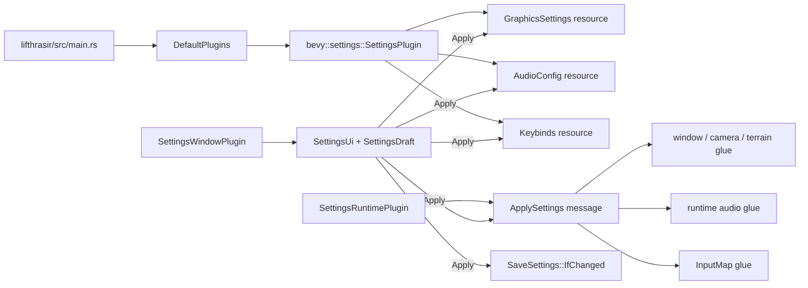
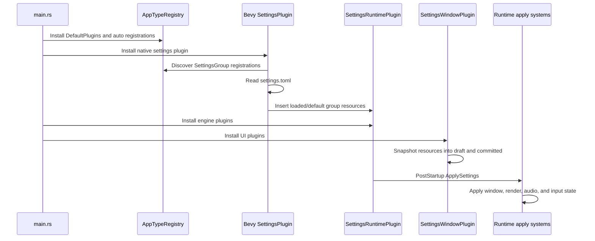
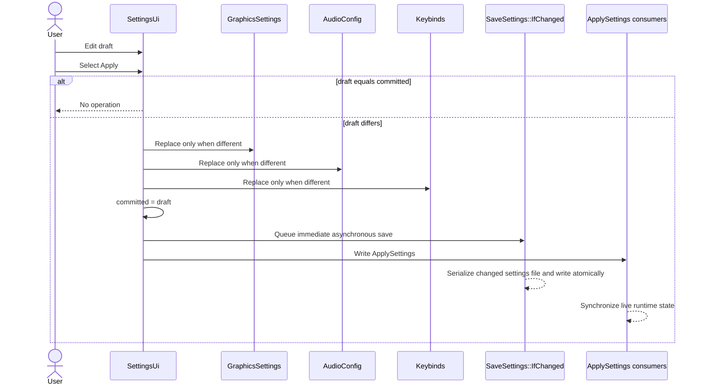
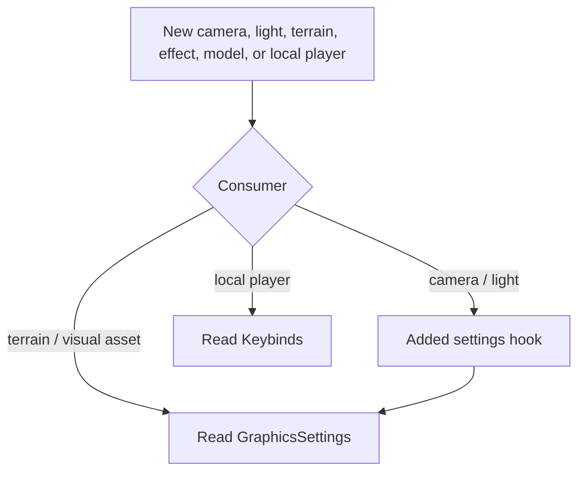

# Bevy App Settings Migration Architecture

## Summary

This design implements the approved
[Bevy App Settings migration spec](./spec.md) by making graphics, audio, and
keybinds native Bevy `SettingsGroup` resources. Bevy owns loading and saving;
Lifthrasir retains only a small runtime synchronization plugin and the existing
UI draft workflow.

## Considered Approaches

### 1. Native resources with the existing `ApplySettings` message

The three settings domains become ordinary Bevy resources. The existing
`ApplySettings` message remains the explicit signal that committed values must
be copied into window, rendering, audio, and input runtime state.

This is the chosen approach. It replaces persistence without destabilizing the
existing runtime side effects, initial application, or late-spawn hooks.

### 2. Native resources with resource change detection

Runtime systems could replace `ApplySettings` readers with
`resource_changed::<T>` conditions.

This would delete one message, but initial application would depend on change
ticks established before the systems are installed, and a single UI Apply would
become three independent synchronization signals. It is less explicit for
cross-module work such as terrain anisotropy reapplication.

### 3. One exclusive apply command

The settings UI could queue a custom command that mutates all resources,
updates every runtime subsystem, and saves.

This was rejected because it would couple UI, persistence, rendering, audio,
input, and asset processing into a central operation. That recreates the broad
settings architecture the migration is intended to remove.

## System Overview



`DefaultPlugins` is installed first because Bevy's settings plugin scans the
`AppTypeRegistry` when it is built. The native settings plugin is installed
next, before engine and UI plugins. It discovers the reflected settings groups,
loads `settings.toml`, and inserts loaded or default values as resources.

`SettingsRuntimePlugin` does not persist anything. It owns only the initial
apply signal and systems that translate committed settings into live engine
state. The UI owns only uncommitted draft state.

## Components

### Application bootstrap

**Location:** `lifthrasir/src/main.rs`

**Purpose:** Install Bevy's settings framework early enough for every engine
and UI consumer.

**Interface and dependencies:**

- Enable Bevy's `bevy_settings` Cargo feature in the workspace dependency.
- Add
  `bevy::settings::SettingsPlugin::new("com.github.endurnyrproject.lifthrasir")`
  after `DefaultPlugins`.
- Keep `MapPlugin`, `CoreGamePlugins`, network adapters, and
  `LifthrasirUiPlugin` after the native settings plugin.
- Do not add a direct `bevy-settings` dependency; consume it through Bevy.

The resulting relevant order is:

```text
DefaultPlugins
→ bevy::settings::SettingsPlugin
→ MapPlugin / CoreGamePlugins
→ network adapter
→ LifthrasirUiPlugin
```

### Native settings groups

**Location:** `game-engine/src/domain/settings/resources.rs`

**Purpose:** Define the three independently addressable persisted resources
using the existing domain values and defaults.

**Interface:**

- `GraphicsSettings`: section `graphics`
- `AudioConfig`: section `audio`
- `Keybinds`: section `keybinds`

Each top-level type derives `Resource`, `SettingsGroup`, and `Reflect`, and
registers `Resource`, `SettingsGroup`, and `Default` reflection metadata.
Existing manual `Default` implementations remain the source of first-run and
missing-field values.

The settings module imports Bevy's `SettingsGroup` derive and
`ReflectSettingsGroup` type data from `bevy::settings`; no Lifthrasir trait or
registration wrapper is introduced.

All three groups use Bevy's default settings source, so they are sections in
one `settings.toml`. Nested setting types keep the reflection traits needed by
Bevy's typed reflection serializer.

The aggregate persisted `Settings` type is deleted. Settings-only
`Serialize`/`Deserialize` derives, `#[serde(default)]` attributes, and legacy
RON compatibility tests are removed. Domain conversion helpers such as
`Keybinds::to_input_map`, graphics labels, cycling, and render mappings remain.

### Runtime synchronization

**Locations:**

- `game-engine/src/domain/settings/mod.rs`
- `game-engine/src/domain/settings/events.rs`
- `game-engine/src/domain/settings/apply.rs`
- `game-engine/src/lib.rs`

**Purpose:** Apply already-loaded or newly committed settings to runtime
objects that Bevy's persistence framework does not configure.

The current custom `SettingsPlugin` is renamed to `SettingsRuntimePlugin` to
avoid collision with Bevy's plugin and to describe its reduced responsibility.
It remains an internal member of `CoreGamePlugins`; it is not presented as a
second persistence API.

`emit_initial_apply` remains in `PostStartup`. Its `ApplySettings` message is
read during `Update` by:

- `apply_graphics`, using `Res<GraphicsSettings>`
- `apply_audio`, using `Res<AudioConfig>`
- `apply_input`, using `Res<Keybinds>`
- terrain anisotropy reapplication, using `Res<GraphicsSettings>`

Camera and directional-light `Added` hooks remain. Their entities can appear
after the initial message, so they read `GraphicsSettings` directly when they
spawn.

Graphics helper functions take `&GraphicsSettings` instead of the deleted
aggregate. Tests construct only the resource relevant to the system under test.

### Settings UI draft

**Location:** `lifthrasir-ui/src/widgets/settings_window/mod.rs`

**Purpose:** Preserve Apply/Cancel/Reset without persisting a second aggregate.

A new UI-only `SettingsDraft` contains:

```text
graphics: GraphicsSettings
audio: AudioConfig
keybinds: Keybinds
```

`SettingsUi` retains `draft`, `committed`, the selected tab, and pending key
capture. Both snapshots are `SettingsDraft` values. Its derived `Default` is
replaced by an explicit `FromWorld` implementation. `SettingsUi::from_world`
clones the three already-loaded resources when `SettingsWindowPlugin` calls
`init_resource`; this removes the first-Update `seed_from_persistent` system.
Required resource access makes incorrect plugin ordering fail during UI plugin
initialization.

The Apply observer:

1. Returns immediately when `draft == committed`.
2. Compares each active resource to the matching draft group.
3. Assigns only resources whose value differs.
4. Sets `committed = draft`.
5. Queues `SaveSettings::IfChanged`.
6. Writes `ApplySettings`.

Comparisons occur before mutable dereferencing. This avoids marking unchanged
resources as changed merely by passing `ResMut<T>` through a mutable
deref-coercion.

Cancel restores `draft = committed` and clears key capture. Reset assigns
`SettingsDraft::default()` but changes no active resource until Apply. The BSN
scene and control marker systems do not change.

### Direct settings consumers

Every former `Res<Persistent<Settings>>` consumer takes only its domain
resource:

| Resource | Consumers |
|---|---|
| `GraphicsSettings` | `domain/settings/apply.rs`, `domain/world/terrain.rs`, `infrastructure/assets/animation_processing_system.rs`, `presentation/rendering/models.rs`, `domain/effects/sprite_effects.rs`, `domain/effects/status_visuals.rs`, `domain/entities/sprite_rendering/systems/cart.rs`, `domain/emote/assets.rs` |
| `AudioConfig` | `domain/settings/apply.rs` |
| `Keybinds` | `domain/settings/apply.rs`, `domain/character/local_player.rs` |

No compatibility alias or wrapper replaces `Persistent<Settings>`.

### Removed persistence implementation

**Deleted:** `game-engine/src/domain/settings/persistence.rs`

The `persistence` module and `settings_path` export are removed.
`bevy-persistent` is removed from the workspace, `game-engine`, and
`lifthrasir-ui` manifests.

The `dirs` and RON dependencies remain because
`game-engine/src/domain/hotbar/persistence.rs` is a separate per-character
storage mechanism outside this migration.

## Data & Flows

### Startup



Bevy's plugin scans the type registry only during its `build` call, so both
`DefaultPlugins` and reflected type auto-registration must be available before
it is installed. All settings consumers are installed afterward.

### User Apply



All groups share one file, so Bevy serializes one coherent snapshot after the
three assignments. Runtime application can occur later in the same frame or
the next frame according to existing message/system ordering; the current UI
already has that behavior.

### Later entity and asset creation



Late consumers read the current resource rather than relying on the startup
message being replayed.

## Technology Choices

- **Bevy App Settings 0.19:** selected because it is the upstream framework
  required by the spec. It supplies reflection-based discovery, defaults,
  platform storage, TOML serialization, change-aware saves, and atomic file
  replacement.
- **`SaveSettings::IfChanged`:** selected over `SaveSettingsDeferred` because
  Apply is an explicit, infrequent commit. It immediately snapshots changed
  settings and performs file I/O asynchronously.
- **One TOML file with three sections:** use Bevy's default source. Separate
  files add no isolation needed by the product.
- **Existing `ApplySettings` message:** retained as domain synchronization, not
  persistence. It avoids an unnecessary change-detection rewrite.
- **Reflection instead of settings-domain Serde/RON:** follows Bevy's native
  data path and deletes legacy compatibility code.
- **No custom exit interception:** Apply requests an immediate asynchronous
  save. Adding window-close control and synchronous writes would expand the
  migration and contradict the accepted non-blocking Apply semantics.

## Error Handling & Edge Cases

- **Missing settings file:** Bevy inserts each group's `Default`; Lifthrasir
  adds no first-run file logic.
- **Malformed TOML:** Bevy logs the parse error and inserts defaults.
- **Unknown or invalid fields:** Bevy applies fields it can decode to a default
  value; unsupported fields remain at their defaults.
- **Save failure:** Bevy logs the filesystem error. Runtime resources and the UI
  committed snapshot remain applied; there is no rollback.
- **Clean Apply:** performs no resource mutation, save, or runtime reapply.
- **Partial draft change:** only differing resources receive mutable access.
  Bevy saves the shared file if any group changed.
- **Incorrect plugin order:** `SettingsUi::from_world` cannot initialize without
  all three resources, exposing the bootstrap error instead of silently
  creating an unrelated UI default.
- **Unsupported DLSS:** existing graceful runtime handling remains unchanged.
- **Old RON file:** ignored and left untouched.
- **External settings writers:** the UI's `committed` snapshot assumes the
  settings window is the sole writer of these resources. No other writer exists
  in the current design; if one is added later, it must also refresh the UI
  snapshot.
- **Hotbar persistence:** remains separate and continues using its existing
  per-character RON files and `dirs` path.

## Testing Strategy

### Unit tests

- Preserve default, cycling, graphics mapping, and keybind-to-`InputMap` tests.
- Remove aggregate RON round-trip and legacy missing-field tests.
- Assert explicit `SettingsGroup` names for graphics, audio, and keybinds.
- Replace `Persistent<Settings>` fixtures in `domain/settings/apply.rs` with the
  relevant plain resources.
- Preserve audio synchronization assertions using `AudioConfig`.
- Rewrite UI Apply tests around `SettingsDraft` and three resources:
  - dirty draft commits values and requests runtime application;
  - clean draft is a no-op;
  - Cancel restores the committed snapshot and clears capture;
  - Reset changes only the draft;
  - audio and keybind controls still edit the matching draft fields.
- Add one focused `SettingsUi::from_world` test proving it snapshots all three
  loaded resources.

### Integration and build verification

- Run workspace formatting, tests, and checks.
- Ensure no source or manifest references to `bevy-persistent`,
  `Persistent<Settings>`, or the deleted settings persistence module remain.
- Confirm `dirs` remains referenced only by the hotbar persistence boundary.

### Manual verification

1. Launch without Bevy's TOML file and confirm existing defaults.
2. Change one setting in each group and Apply.
3. Confirm graphics, audio, and input update at runtime.
4. Restart and confirm all three applied values reload.
5. Verify Cancel, Reset, and the dirty indicator.
6. Confirm the old `settings.ron` is neither read nor deleted.
7. Spawn/load gameplay content after Apply and confirm cameras, lights, terrain,
   effects, models, and local-player input use current values.

## Critique Findings

The critique confirmed that replacing `ApplySettings` with change detection
would save little code while making startup and multi-group synchronization
less explicit. The message remains a justified runtime boundary.

Bevy's plugin scans the type registry only when installed. The final design
therefore makes `DefaultPlugins → SettingsPlugin → consumers` a binding
bootstrap invariant and initializes the UI from required resources to expose
ordering mistakes.

Synchronous save-on-exit was reconsidered. The approved semantics explicitly
accept asynchronous persistence after Apply, and `SaveSettings::IfChanged`
starts that save immediately. Custom exit interception was rejected as
unnecessary scope.

The initial spec incorrectly treated `dirs` as settings-only. Exploration found
the independent per-character hotbar persistence consumer. The spec and this
design now retain `dirs` for hotbars while removing it from app settings.

The UI retains a committed snapshot in addition to native resources. This is
accepted because it preserves existing dirty/Cancel behavior with minimal
system churn. It assumes the UI is the sole resource writer, which matches the
current application.

## Open Questions

None. The architecture is fully specified for task decomposition.
